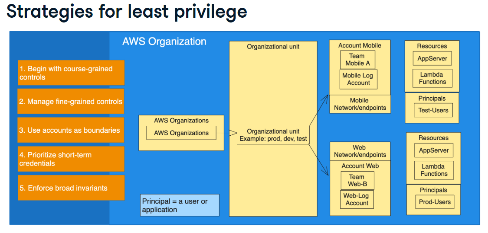
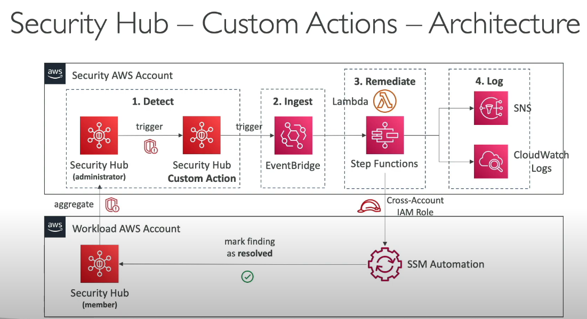
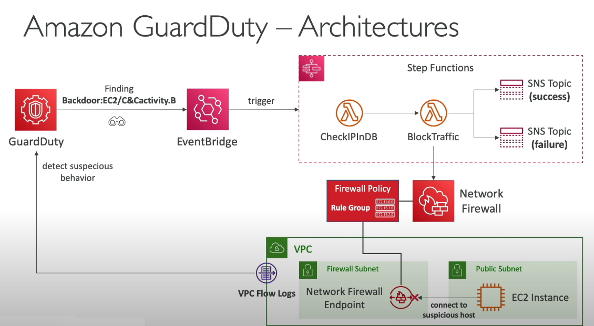

# Cloud Security Implementation

Hardening Cloud Security, Information Security, Cloud Security Posture Management (CSPM)

## ➦ Cloud Security Posture Management (CSPM)
CSPM continuously monitors the cloud environment for security misconfigurations, vulnerabilities, and compliance issues. AWS Security Hub will act as a central hub for CSPM, offering a consolidated view of security posture across of  AWS account. As a part of this Security Hub implementation following services will be considered/integrated:

- Amazon Inspector: Helps in scanning EC2 instances for vulnerabilities and exposures. Security Hub integrates these findings for a holistic view.
- AWS Config: Continuously monitors and records AWS resource configuration changes. Security Hub leverages this data to identify deviations from your security best practices.
- Macie: Discovers and classifies sensitive data stored in S3 buckets. Security Hub can use this information to alert you of potential data breaches.
- CloudWatch Events: Enables automated remediation workflows based on Security Hub findings. Imagine automatically patching an EC2 instance with a critical vulnerability.

## ➦ Developing and implementing security workflows and automation scripts
By creating rules in Amazon EventBridge, it can respond automatically to AWS Security Hub Cloud Security Posture Management (CSPM) findings. Security Hub CSPM sends findings as events to EventBridge in near-real time. Rules can be written to indicate which events are interested in and what automated actions to take when an event matches a rule.

Although, bash scripts can be used by taking the help of AWS CLI commands to add more customizations.

## ➦ Conducting security assessments and audits 
AWS Audit Manager can be used to capture Security Hub findings as evidence for audits. By creating a custom control, Security Hub controls can be specified as a data source mapping for evidence collection. Security Hub performs compliance checks based on these controls, and Audit Manager reports the results as compliance check evidence.

## ➦ Responding to security alerts and incidents 
AWS Lambda can be used to automatically remediate security incidents in response to Security Hub alerts.
For ex. if Security detects an IAM user making unauthorized API requests from an unfamiliar IP, Lambda can automatically:
- Disable the IAM user
- Notify security teams via Amazon SNS

## ➦ Ensuring compliance with relevant security standards and regulations
Once correctly configured and required standards are enabled, Security Hub automatically verifies whether the systems follow rules like PCI, NIST, and HIPAA. If something is wrong, it shows the problem that can be fixed early.

## ➦ Building Dashboards
Security Hub provides a built-in Summary dashboard with customizable widgets, The Summary dashboard allows for some customization, such as adding or removing widgets, filtering data, and saving filter sets.

For more advanced dashboarding and visualization capabilities, it would indeed need to look at external solutions like, AWS QuickSight

## ➦ Applying CIS benchmarks
The Center for Internet Security (CIS) AWS Foundations Benchmark serves as a set of security configuration best practices for AWS. These are like a security checklist guide for everything from IAM policies to S3 bucket permissions.

## ➥ Security Management
- Safeguarding the entire DevOps environment through strategies, policies, processes
- Entail embedding governance and cybersecurity functions such as IAM, privilege management, firewalling / unified threat management, code review, and vulnerability management throughout the DevOps workflow
- Security Alignments: Implement security measures throughout the development and deployment lifecycle, ensuring compliance with industry standards. Have implemented HIPAA and PCI-DSS compliances
- Database Encryption, Encryption at rest, Encryption at transit
- Deep understanding of IAM (to securely control AWS resources accesses) users, roles, policies and Security Groups to secure the applications, infrastructure components, servers etc.
- Threat Modeling and Risk Analysis: Identify potential security threats and assess the risk associated with them. 
- Security Policy Implementation: Develop and implement security policies and procedures to protect the organization's assets. 
- Vulnerability Management: Identify, assess, and mitigate security vulnerabilities. 
- Data Protection: Implement measures to protect sensitive data and prevent data breaches
- Tools: Hashicorp Vault, onetimepassword, lastpass, SSH Keys, JWT Tokens, Cognito, SSO, Shield, WAF, IAM, Security hub, Trusted Advisor, Guard Duty

## ➥ Architectures

